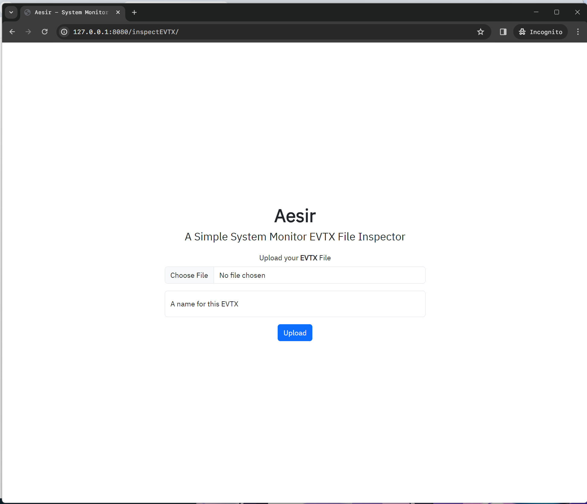
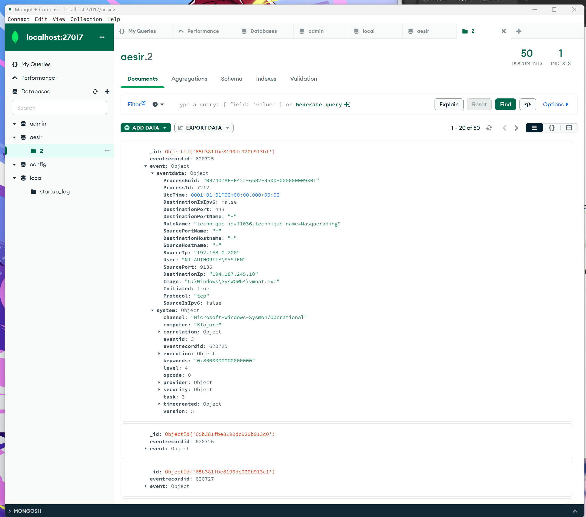

# aesir
# **Under development...**

### A simple System monitor(Sysmon) EVTX inspector; search, visualize, and track Sysmon events

## Preview
You can upload your own Sysmon EVTX file with your own name

Based on **MongoDB**, Your EVTX data will be structurally managed.
